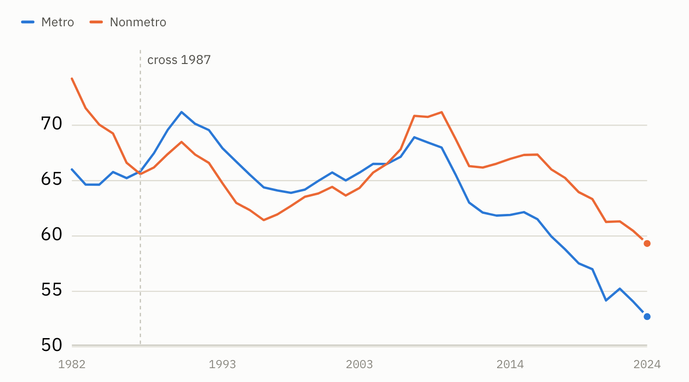
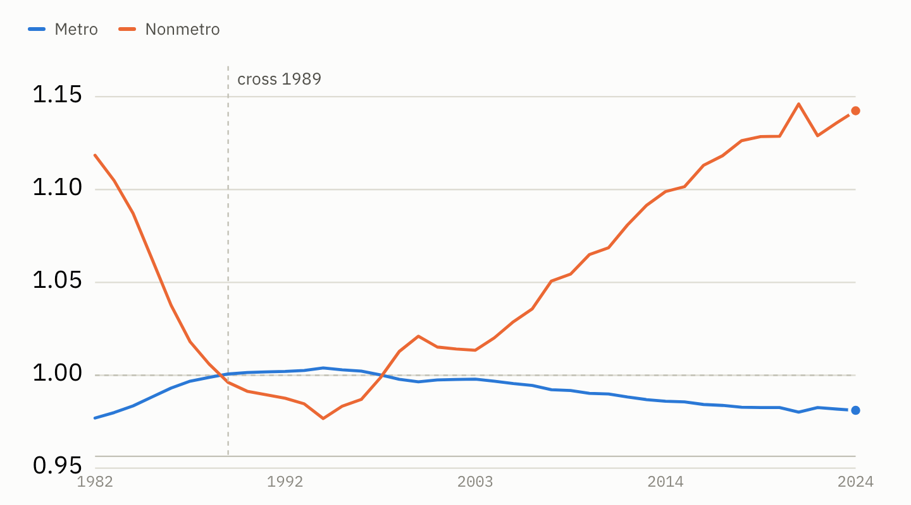

# The fertility decline is real, recent, and everywhere

It's probably not a surprise that the fertility rate is in structural decline. There's been all sorts of media coverage on this.

But the point of consulting the data is to fill in the blanks around the simple narrative that the media feeds us. It's not their fault. They have word limits (we don't — although we're trying harder to rein in our verbosity) and they compete with social media for your attention and the resulting advertising dollars (we don't — no qualifiers needed).

So today we'll analyze the data in [this dashboard](https://data4thepeople.github.io/BirthRate/map.html) to get a more complete understanding of what's going on with the fertility rate.

## Why fertility rate matters

Fertility rate is essential, if we care about the future of this country. No matter what you are told, people are at the heart of this economy and society. We can't out-smart needing people for this country to thrive.

And why would we want to? Isn't the purpose of a functioning society to provide the structure for its people to be better off than if we were all just on our own — picking berries, bartering, and so on?

So if our society's greatest asset, and its entire reason for existence, is its own people and not its technology, well then: Houston, we have a problem. There are tectonic shifts happening that tilt the people we have toward those at the end of their lives and out of work, while stagnating those in their prime working years. [The Census Bureau expects](https://www.census.gov/library/stories/2018/03/graying-america.html) older adults to outnumber children by 2034, and the number of working-age adults per retiree to fall from about 3.5 today to 2.5 by 2060. That's a bad thing for a society designed to have the workers support the retirees.

And then to make matters worse, we keep setting record lows in the fertility rate — in four of the last five years, and 2024 the lowest since national records began in 1909 — making fewer babies to replace our aging population. That's arguably the most concerning part, because it's today's babies who have the potential to pull us out of whatever economic fate we're now facing. Fewer babies, and personally I have less hope. [Ask Japan](https://crr.bc.edu/the-shrinking-of-japan-a-harbinger-of-what-will-happen-to-the-u-s/).

So this topic is of critical importance for all of us.

## Split it metro versus rural

But as shown below, the narrative is not as simple as we are told. Look what happens to the fertility rate trends when you split them metro versus nonmetro and go back to 1982.

*Births per 1,000 women aged 15–44, metro versus non-metro counties. Counties are held on a fixed 2013 classification, so a county does not change groups when a city grows into it.*

I was not shocked to see metro fertility rates much lower than nonmetro. I was also not shocked to see them both in decline in recent years.

What was new to me were two things.

## Rural America already had its fertility crisis

Nonmetro America has already been through a fertility crisis in this period — declining from **74.2 in 1982 to a trough of 61.4 in 1996**, a fall of 17%, before rebounding all the way back to 71.2 by 2009.

I had no idea. And you don't see it in the overall data, because the metro rate spent those same years going nowhere in particular — up about 10% from 1984 to 1990, then giving all of it back by 1996, ending the stretch 2% below where it started. The national rate is a weighted average, and in 1982 five in six women aged 15–44 lived in metro counties. Flat on the side holding most of the women, and a 17% collapse on the side that isn't, come out to a national decline of 5%. A rural crisis showed up in the headline number as a wobble.

This topic is so interesting to me that it will be the focus of tomorrow's post.

## The break starts at the financial crisis

The second thing: this steep falloff in the birth rate is a more recent phenomenon than I thought. There's a clear break in the data at the Great Financial Crisis. Metro fertility tops out in 2007, nonmetro in 2009, and neither has had a good year since. Metro is down 24% from that 2007 high, nonmetro 17% from its 2009 one. Neither has been near its all-time best since the early 1990s.

The decline dates from that shock, and it turns up in every kind of county — though not evenly. Large metro counties are down 24% since 2007; remote rural counties, 9%. Everywhere, but hardest in the biggest cities. That's also fascinating. I did a few checks of the most likely culprits in the data — notably, women's labor force participation rate since 2008 — and there's no obvious cause-and-effect explanation for this dynamic, at least none we can write about in the next few days. But we'll dig deeper and return to this topic when we have something to share.

## Before drawing conclusions, some sanity checks

There are a few more details to check. Two things could be faking this result: the ages of the women we are counting, and where those women live.

The answer comes back no every time. And in the case of age, correcting for it makes the recent decline look worse, not better.

### Q1: Is the gap between metro and rural just an age gap?

Start with why this could matter. A woman of 25 is far more likely to have a baby than a woman of 43. Both count as 15 to 44. So the mix of ages inside that bracket moves the birth rate all on its own.

Picture two counties with the same number of women aged 15 to 44. In one, most of them are 27. In the other, most are 41. The first county should record more births. This makes sense, but wouldn't be captured in our analysis so far.

And that is exactly the worry here. Metro women are slightly older than rural women, and have been in every year since 1982. It is a small difference, but it pushes the wrong way: it would hold the metro rate down and make the rural advantage look bigger than it really is. We have to rule that out.

Here's how we adjust for this. Take one group of women. Ask a simple question: how many babies would they have if they had the national birth rate for their exact ages? Call that the expected number. Then count the babies they actually had.

Divide the actual by the expected, and you get one number:

- **1.00** means the group had exactly as many babies as expected. Dead average.
- **Above 1.00** means more babies than expected.
- **Below 1.00** means fewer.

That number is what the chart below shows. It is a ratio, not a rate, so the scale sits near 1 instead of climbing to 70 like the earlier chart.

*Births actually recorded, divided by the births expected from each group's own age mix. 1.00 is the national average for that year.*

Rural counties finish at 1.14. That means rural America had 14% more babies than its own age mix predicts. Metro finishes at 0.98, a shade below average. The two lines still cross twice, in the same order as before.

So the metro and rural gap is real. It is not one side simply being older.

### Q2: Is the national decline just women getting older?

One catch, and it matters. This chart measures each group against the national average of that same year. It can tell you who is above or below average. It cannot tell you whether the average itself is falling. That takes a different test.

So here is that test. Take the ages of American women as they stood in 1982 and freeze them. Then let only the birth rates move. If aging were driving the decline, holding the ages still should make the decline go away.

It does not. The rate still falls, from 67.1 to 55.8. That is a drop of 17%, against the 21% we actually saw. So aging inside the 15 to 44 bracket explains about a sixth of the long decline. Real, but not the story.

And for the drop since 2007, it explains none of it. With the ages held still, the fall since 2007 is 27% rather than 23%. The age mix has been working in our favor these past fifteen years. Take that help away and the collapse looks worse, not better.

### Q3: Is the national decline just women moving to the cities?

They genuinely did move. Non-metro counties held 16.5% of American women aged 15–44 in 1982, and 12.1% by 2024.

But that does not answer the question. Knowing women moved does not tell us whether the moving is what pushed the birth rate down. To find that out, we freeze everyone in place. Nobody moves between 1982 and 2024. We let only the birth rates change, and see how much of the decline still happens.

Almost all of it. The national rate really fell 13.8 points. With everyone frozen in place it still falls 13.5 — **97% of the real decline**. Where women lived accounts for the other 0.4.

## What we're left with

A real finding. Women are having fewer babies just about everywhere in this country — in 84% of counties, and in every one of the nine county types from big-city to remote rural.

Tomorrow: what happened to nonmetro fertility rates in the 1980s and 1990s? And what can we learn from it about what to expect going forward?
