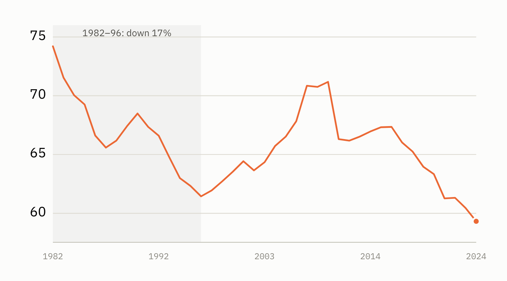
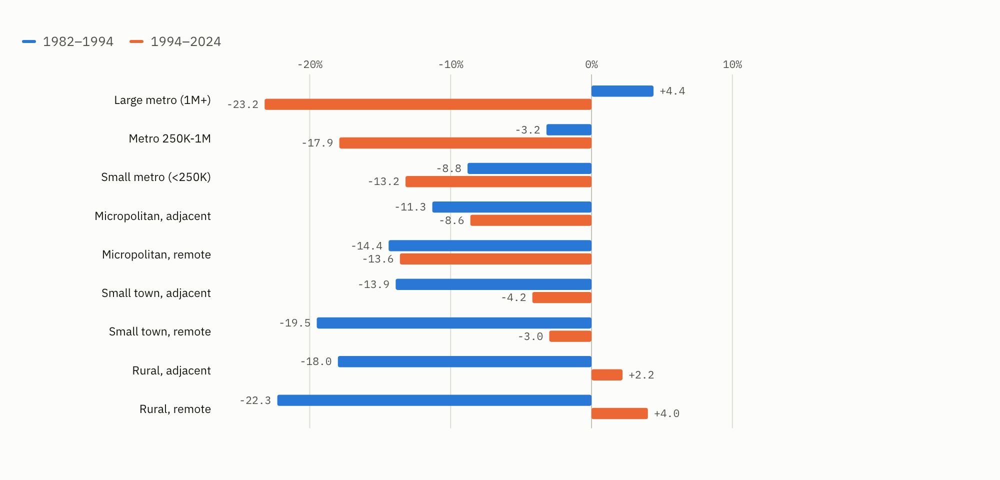

# The collapse of the fertility rate in rural America in the 1980s

Yesterday we split the fertility rate into metro and non-metro. One thing that surfaced was the steep drop in non-metro fertility in the 1980s and 1990s. We showed you the "what" yesterday. Today we explore the factors that, together, help us close in on the "why." Then we hold that unique time in American history up against today, another unique time. The goal is to see if we can learn anything that might prepare us for what comes next.

*Births per 1,000 women aged 15–44 in non-metro counties. The shaded years are the ones this post is about.*

## The setup: a debt-fueled boom

In 1972 the Soviet Union quietly bought about a quarter of the American wheat crop. It became known as the Great Grain Robbery. Prices spiked, and what followed was American farming's best decade since the First World War.

Nixon's agriculture secretary, Earl Butz, told farmers to plant "fencerow to fencerow." He told them to "get big or get out." He also tore down much of the New Deal system that had paid them to leave land idle. Farm exports climbed from about $8 billion in 1972 to $44 billion by 1981. Farmland values roughly tripled. Iowa cropland went from a few hundred dollars an acre to over $2,000.

Inflation was high. Interest rates lagged behind it. So the real cost of borrowing was close to zero. Borrowing to buy land was not reckless — it was the obvious move, and nearly everyone made it. Total farm debt went from roughly $50 billion to over $200 billion.

The detail that mattered later: farmers borrowed **against the inflated land values**. If land prices fell, the loan would still be there and the thing backing it would not.

## The trigger

Three shocks landed almost together.

**Volcker.** Paul Volcker took over the Federal Reserve in 1979 and broke inflation by pushing interest rates to roughly 20%. Farm operating loans were typically variable-rate. Debt service exploded.

**The grain embargo.** After the Soviet invasion of Afghanistan, President Carter embargoed grain sales to the USSR in January 1980. The Soviets bought from Argentina instead. President Reagan lifted the embargo in 1981; the market share did not come back.

**The dollar.** High US rates pulled in foreign money and drove the dollar up. That happened just as Brazil, Argentina and Europe brought on the farm capacity they had built during the boom. American farm exports fell roughly 40% from their peak.

Crop prices fell, and land values fell with them. Midwestern farmland dropped 40 to 60% from its 1981 peak. That is what turned a downturn into a catastrophe. A farmer who had borrowed $800,000 against land now worth $400,000 was broke, however well he farmed.

Hundreds of thousands of farms disappeared. Hundreds of rural banks failed. The Farm Credit System needed a federal rescue in 1987. Rural suicide rates climbed, states opened farm crisis hotlines, and Willie Nelson staged the first Farm Aid in 1985.

## History comes to life in the data

That is the history. Does it show up in the data?

We can find out. The USDA has a classification system for counties. For example, a county is placed in the "farming" category if farming supplied 20% or more of its income over 1975–79. Mining counts at 20% in 1979, manufacturing at 30%, government at 25%. "Retirement counties" are places where people aged 60 and over moved in at a net rate of 15% or more during the 1970s. Persistent poverty is a different kind of flag. It marks a county in the bottom fifth of income per person at every census from 1950 to 1979.

We use the edition measured before the early-1980s bust on purpose. A county that lost its farms in the crisis would drop out of a later edition's farming group, and the counties hit hardest would vanish from the very group we are trying to measure.

The categories are not mutually exclusive. In other words, one county can be a "farming" county and also be a "persistent poverty" county. In fact, a quarter of the persistent-poverty counties are also farming counties (tells us something about farming).

With that setup in mind, take a look at the following chart. It shows the fall in each group's fertility rate from 1982 to 1987. That is one rate for the whole group — every birth in those counties over every woman aged 15 to 44 in them — not the median county.

*Fall in the fertility rate, 1982–87. The top bar is every non-metro county; the bracketed bars break that group out by what its economies ran on in 1975–79. Metro counties sit apart as the comparison.*

While the fertility rate in farming counties fell harder than overall nonmetro, mining counties got hit much harder. The two groups barely overlap: six counties out of roughly 740. The mining counties are where you would expect. Texas, Kentucky, Wyoming, West Virginia, Colorado, Utah. Oil patch and Appalachian coal.

Why mining? Same reason, different commodity.

Oil went from about $35 per barrel in 1981 to $10 by 1986, a far more extreme drop than grain prices, which were down by about a third over the same five years. The price crashes had different causes — the 1986 oil collapse came when Saudi Arabia stopped defending the price and opened the taps — but what the two busts shared was timing and victim: rural counties that were heavily reliant on different commodities and had borrowed against the boom.

Take this same data and put it on a trend chart and you can really see the difference between mining/farming counties and the other nonmetro counties.

*Births per 1,000 women aged 15–44, 1982 to 2024. "All other non-metro" is every non-metro county with neither a mining nor a farming flag — 1,208 counties, against 140 mining and 604 farming. Metro counties are shown for comparison.*

Mining and farming counties start the series together, at 83 and 84, and fall together through the bust. Then they separate. By 2024 mining counties are no different from the rest of non-metro America. Farming counties are still nine points above it — a premium that survived the crisis.

## The pattern flipped in 1994

There is a second way to see it. Rank counties along the USDA's rural–urban scale, from big city to remote countryside. Each era produces a clean staircase. The two staircases run in opposite directions, and they are almost the same size.

*Change in the fertility rate across the nine rural–urban classes, 1982–1994 against 1994–2024. Read down the rows: the first era's bars grow as the counties get more rural, the second era's shrink.*

**1982 to 1994:** large metro +4.4%, small metro −8.8%, small town −19.5%, remote rural −22.3%. The more rural, the harder the fall.

**1994 to 2024:** large metro −23.2%, small metro −13.2%, small town −3.0%, remote rural +4.0%. Exactly inverted.

Whatever reshaped American fertility did not simply spread from city to countryside. It flipped, and it flipped around 1994.

## History rhymes

So what can we learn from this, and how does it rhyme with today? None of what follows is a forecast. It is a list of what looks familiar, then a list of what does not.

**Boom leads to bust.** The 1970s farm boom was real — prices, exports and land values all tripled — and it set the stage for what followed in the 1980s. Farmers borrowed against inflated land because it was the obvious move, until the land was worth half as much and the loan was not. Fast forward to today, and farmland values are [up about 150% since 2010](https://www.ers.usda.gov/topics/farm-economy/land-use-land-value-tenure/farmland-value) and sit near record highs. Farm real estate makes up 83% of the sector's assets, and it is what the loans are written against — exactly as it was in 1981. History keeps teaching this lesson, and we keep having to relearn it.

**Farming is getting more expensive.** In 1980 the grain embargo sent the Soviets to Argentina, and when the embargo lifted the market share did not come back. In 2025 tariffs, and the retaliation to them, sent China to Brazil. [US soybean sales to China fell from $12.6 billion in 2024 to $3.1 billion](https://www.fb.org/market-intel/agricultural-trade-china-steps-back-from-u-s-soybeans). A deal since commits China to 25 million tons a year through 2028. Given the geopolitical tension between the two countries, it is probably not smart to count those chickens before they hatch.

Tariffs cut the other way too. They raise the price of the steel, equipment and parts a farm has to buy. And since February, the war with Iran has closed the Strait of Hormuz, which carries about a third of the world's fertilizer. [Fuel and fertilizer costs are up 20 to 40%](https://www.pbs.org/newshour/show/farmers-warn-of-food-price-spike-as-war-drives-up-fuel-and-fertilizer-costs), and [nitrogen and diesel are heading into harvest well above the last two years](https://farmdocdaily.illinois.edu/2026/08/fertilizer-and-fuel-prices-higher-heading-into-fall-2026.html).

There is one notable difference in how the two stories play out, though the outcome is the same. The 1980s squeezed farmers on the income side, through collapsing prices and exploding loan payments. Today squeezes them on the cost side. Either way, running a farm is getting harder, on several fronts at once, for reasons the farmer did not cause and cannot control.

**The rate shock, and where 1976 was.** While we do not have a Paul Volcker, what we do have is a setup for structural inflation. We have written before about [what is happening to diesel](https://www.data4thepeople.com/p/running-out-of-diesel), and how it ripples through everything that moves by truck. We have also written about the [labor-force trends](https://ohiocapitaljournal.com/2026/09/02/where-have-the-workers-gone-2-million-foreign-born-men-have-left-the-country-analysis-says/) that push the same way. A built-in inflation problem, if that is what this is, eventually forces rates up to meet it. The only thing that derails that, in our view, is an outright slowdown that destroys enough demand to pull prices back down.

Here the late 1970s are worth a close look, because the interesting question is not how high rates went but where they started. [Inflation bottomed at 5% in December 1976](https://www.federalreservehistory.org/essays/anti-inflation-measures). By the time Volcker took office in August 1979 it was running at 9%, and the Fed's main interest rate was already near 11% before he had done anything. It took three years, an oil shock, and a Fed that had already doubled rates to get to the point where Volcker's 20% was the only move left. That oil shock came from Iran, then too — another uncanny parallel worth chewing on.

Today's measured inflation is 3.4%. As we have written, [actual inflation is likely higher than that](https://www.data4thepeople.com/p/cpi-merry-go-round). The fed funds rate is 3.5 to 3.75%, and the [30-year Treasury touched 5.31% in August](https://www.cnbc.com/2026/08/17/treasury-yields-federal-reserve-fomc-minutes.html), its highest since 2007. On inflation and the Fed's rate, that is roughly where the 1970s stood in 1976 or 1977, with an Iranian oil shock underway. The one number that was higher then is the long bond: the [30-year yielded about 7.7% when it was first issued in 1977](https://fred.stlouisfed.org/series/DGS30), because a decade of inflation was already priced in. The rhyme is not in the level. It is in the starting point, and in what came next last time.

**Expectations.** Core inflation, which strips out food and energy, is 2.5% (again, if you believe it). The energy shock has not yet leaked into everything else the way it had by 1978. In the 1970s, a decade of rising prices had taught everyone to expect more of them. That expectation is what made inflation so hard to kill. The same setup is in place now, but it is not yet common knowledge. [Retailers have shielded consumers from diesel price inflation thanks to tariff refunds](https://www.cnbc.com/2026/08/30/trump-tariff-refunds-walmart-home-depot-target.html). That is temporary, and it is coming to an end. The concern is what happens the longer this shock lasts. Whether it stays in diesel and fertilizer or seeps into wages and prices, the longer it goes on, the more likely the public feels it in more places than the pump. And if that happens, history tells us not to be shocked if "3.4%" inflation ends up requiring draconian measures a few years down the road.

### And how it looks different

**Leverage.** This is the big one. The farm sector's debt-to-asset ratio is [forecast at 13.8% for 2026](https://www.ers.usda.gov/topics/farm-economy/farm-sector-income-finances/assets-debt-and-wealth). It was 16.2% in 1980, before the crisis, and peaked at 22.2% in 1985. Farmers carry less than two-thirds the debt load into this that they carried into that. That is less than they had *before* the last one started.

**What floats.** In 1981 the typical operating loan had a floating rate, so the Volcker shock hit loan payments right away. Operating loans still float today. But they are the smaller part. Of the $625 billion in farm debt, [$404 billion is real estate](https://www.ers.usda.gov/topics/farm-economy/farm-sector-income-finances/assets-debt-and-wealth), most of it at fixed rates. A rate shock now bites about a third of farm debt directly. In 1981 it bit most of it.

**The backstop.** Net farm income is held up by one-off federal aid on a scale that did not exist in 1982. Farm Aid was a concert.

**The demographic base.** This is a post about births, and here the difference is sharpest. In 1982 rural fertility stood at 74 and had a long way to fall. Today it stands at 59, and the current decline is led by the cities. Large metro counties are down 24% since 2007; remote rural counties, 9%. The 1980s collapse hit a rural fertility premium that has already been spent. Even a full rerun of the economics would not do the same thing to births, because what it broke last time is no longer there to break.

So the rhyme is in the setup, not the outcome. The boom is there, the squeeze is there, and the inflation setup is there. The starting point looks a lot like 1976, and the public has not yet caught on. Against that, the sector carries far less debt, far less of that debt floats, and the people the shock would land on look nothing like the ones it landed on before.

What that adds up to is exactly the thing this data cannot say. But if you've made it to the end of this post, you now know the risks.

## Two honest limits

Rural counties outside mining and farming still fell 10.0%, against 11.6% for non-metro as a whole. So most of the rural decline happens no matter the sector. Some of that is likely rural fertility drifting toward metro norms. Schooling, women's work and the age of marriage were all shifting across the country, and rural places had further to go.

And this remains a description, not a proof. Sorting counties by a pre-crisis edition removes the worst chicken-and-egg problem. But nothing here controls for everything else that goes along with living on a commodity.

What it does show is that the 1980s half of the story is regional, and that it follows what each county's economy ran on. And it is separate from what happened after 2007. That runs the other way, in the other places.
