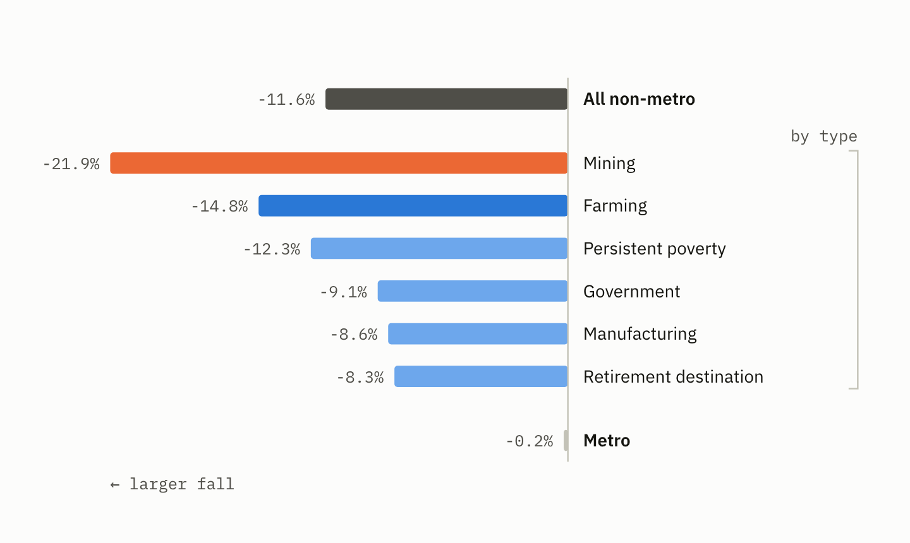
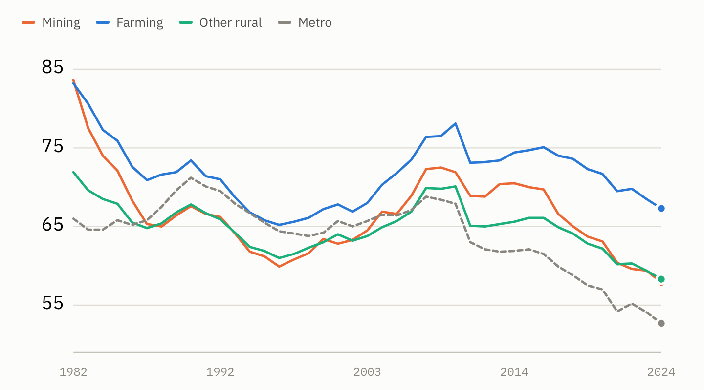

# What broke in rural America in the 1980s

Between 1982 and 1987, the fertility rate in non-metropolitan American counties fell 11.7%. Over the same five years, metropolitan counties did not move at all — down 0.2%.

A shock that size, that fast, confined that precisely to one kind of place, should have a cause you can find. It does. But it is not quite the cause you would guess.

## The setup: a debt-fuelled boom

In 1972 the Soviet Union quietly bought roughly a quarter of the American wheat crop, in what became known as the Great Grain Robbery. Prices spiked, and what followed was the best decade American farming had seen since the First World War.

Nixon's agriculture secretary Earl Butz told farmers to plant "fencerow to fencerow" and to "get big or get out," and dismantled much of the New Deal system that had paid them to hold land idle. Farm exports climbed from about $8 billion in 1972 to $44 billion by 1981. Farmland values roughly tripled; Iowa cropland went from a few hundred dollars an acre to over $2,000.

With inflation high and nominal interest rates lagging behind it, real rates were near zero. Borrowing to buy land was not reckless — it was the obviously correct move, and nearly everyone made it. Total farm debt went from roughly $50 billion to over $200 billion.

The detail that mattered later: farmers borrowed **against the inflated land values**. The collateral and the asset were the same thing.

## The trigger

Three shocks landed almost together.

**Volcker.** Paul Volcker took over the Federal Reserve in 1979 and broke inflation by pushing interest rates to roughly 20%. Farm operating loans were typically variable-rate. Debt service exploded.

**The grain embargo.** After the Soviet invasion of Afghanistan, Carter embargoed grain sales to the USSR in January 1980. The Soviets bought from Argentina instead. Reagan lifted the embargo in 1981; the market share did not come back.

**The dollar.** High US rates pulled in foreign capital and drove the dollar up sharply, just as Brazil, Argentina and the EU brought on the capacity they had built during the boom. American farm exports fell roughly 40% from their peak.

Commodity prices fell, and land values fell with them — Midwestern farmland dropped 40 to 60% from its 1981 peak. That is what turned a downturn into a catastrophe. A farmer who had borrowed $800,000 against land now worth $400,000 was insolvent regardless of how well he farmed. Good operators went under alongside bad ones.

Hundreds of thousands of farms disappeared. Hundreds of rural banks failed. The Farm Credit System needed a federal rescue in 1987. Rural suicide rates climbed, states opened farm crisis hotlines, and Willie Nelson staged the first Farm Aid in 1985.

## Testing it against the births

That is the history. Does it show up in the data?

The USDA classifies counties by what their economies ran on. Crucially, there is an edition based on **1975–79 income shares** — measured before either bust, so a county's classification cannot itself be a consequence of the downturn being studied. Later editions move counties out of the "farming-dependent" category once the farming leaves, which would quietly erase the very effect you are looking for.

Grouping rural counties that way, and measuring the fall in the fertility rate from 1982 to 1987:

- **Mining** — down 21.9%
- **Farming** — down 14.8%
- Unspecialised rural — down 12.7%
- Persistent poverty — down 12.3%
- Government — down 9.1%
- Manufacturing — down 8.6%
- Retirement destination — down 8.3%
- *All non-metro* — down 11.7%
- *All metro* — down 0.2%

Farming-dependent counties do fall harder, and it holds up under scrutiny. They fell further than other rural counties in all four rural–urban classes at equal rurality. County by county, unweighted, the median farming county fell 13.2% against 8.0% for other rural counties — a difference of 3.4 points with a t-statistic of −6.6.

## But mining fell harder

The farm crisis is real in these numbers. It is not the largest effect in them.

*Fall in the fertility rate, 1982-87, for rural counties grouped by what their economies ran on in 1975-79.*

Mining counties fell half again as much as farming counties, and the two groups barely overlap — seven counties out of roughly 750. The mining counties are exactly where you would expect: Texas, Kentucky, Wyoming, West Virginia, Colorado, Utah. Oil patch and Appalachian coal.

Which points at the real organising principle. Oil went from about $35 a barrel in 1981 to roughly $10 by 1986, on the same schedule as grain, driven by the same soaring dollar and the same twenty percent interest rates. The farm crisis and the energy bust were not two events. They were one macroeconomic shock arriving in two industries.

**The 1980s rural fertility collapse tracks commodity exposure.** Rural counties that ran on manufacturing, government or retirement fell about as much as the country as a whole. Rural counties that ran on things dug out of the ground or grown on it fell off a cliff.

## The gradient that reversed

There is a second way to see it. Ranked along the USDA's rural–urban continuum, each era produces a clean monotonic gradient — and the two point in opposite directions at almost mirrored magnitudes.

*The same groups carried through to 2024. Mining and farming counties start far above the rest and converge down onto them.*

**1982 to 1994:** large metro +4.4%, small metro −8.8%, small town −19.5%, remote rural −22.3%. The more rural, the harder the fall.

**1994 to 2024:** large metro −23.2%, small metro −13.2%, small town −3.0%, remote rural +4.0%. Exactly inverted.

Whatever reorganised American fertility did not simply run from city to countryside. It changed sign, and it changed sign around 1994.

## Two honest limits

Even unspecialised rural counties fell 12.7%, so roughly two-thirds of the rural decline happens regardless of sector. Some of that is likely rural fertility converging toward metro norms as education, labour-force participation and marriage timing shifted — a national trend that happened to have further to travel in rural places.

And this remains descriptive. Using a pre-crisis classification removes the worst endogeneity problem, but nothing here controls for everything else that correlates with commodity dependence.

What it does establish is that the 1980s half of the story is regional and economic, and that it is separate from whatever happened after 2007 — which runs the other way, in the other places.
