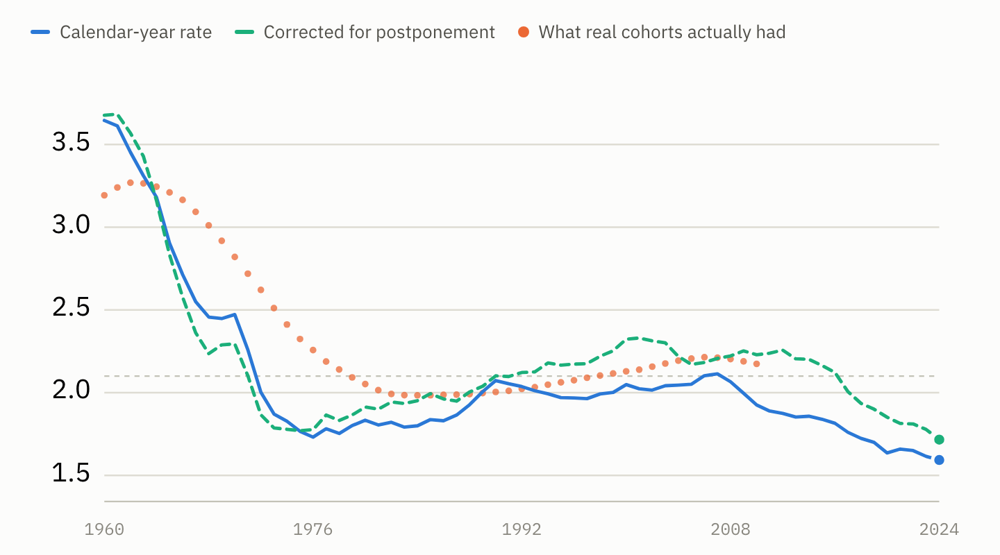
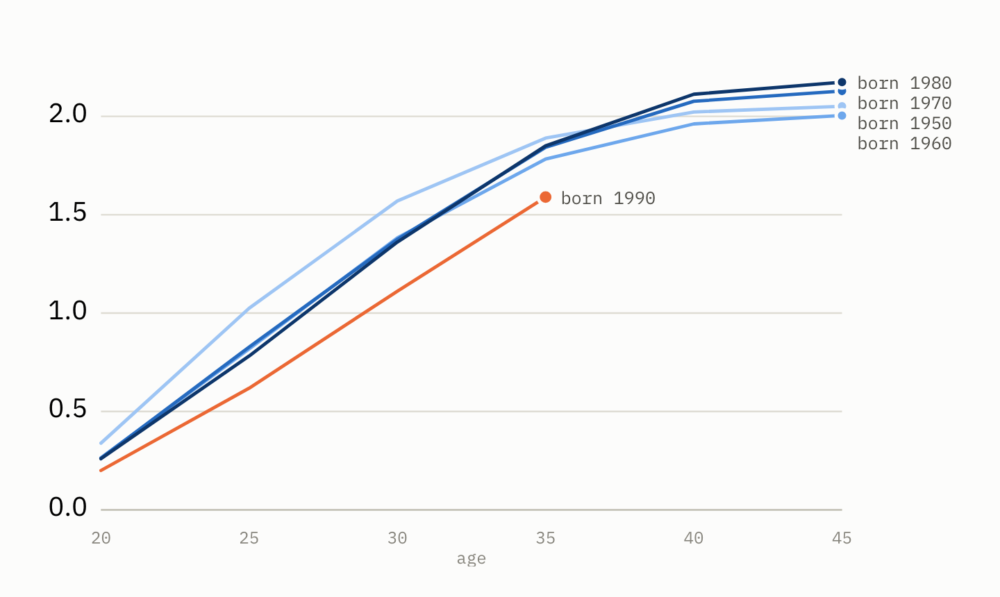
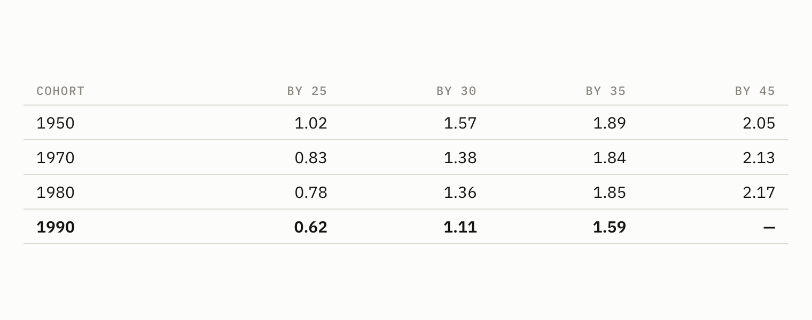

# Later, or fewer?

In 1976 the American fertility rate hit 1.73 children per woman and set off a decade of alarm. Books were written about the birth dearth. The number was real.

The women who were at peak childbearing age in 1976 went on to have **2.26 children each**.

Nothing had gone wrong. They had simply started later than their mothers, and the measure everyone was reading could not tell the difference.

That failure is worth understanding before drawing any conclusion about the present, because the same measure is being read the same way today.

## Why a birth rate can lie

A period fertility rate is synthetic. It asks: how many children would a woman have, if she spent her entire life under this single calendar year's age-specific rates?

No real woman ever does that. And when a generation postpones — starts at 31 instead of 26 — births that will still happen are not happening *yet*. They fall outside the year being counted. The period rate drops, recovers years later when the postponed births arrive, and in between describes a decline that never occurred.

This is called tempo distortion, and it makes postponement and genuine decline look identical in the headline number.

## Two ways to tell them apart

**Follow real generations.** Cohort completed fertility tracks actual women through their whole reproductive span and counts what they had. It assumes nothing. Its limitation is that you must wait — a cohort cannot be measured until it finishes.

**Correct the period measure.** The Bongaarts–Feeney adjustment inflates the rate in proportion to how fast the mean age of childbearing is rising, giving a reading for years no cohort has yet completed. It relies on a model, but it is available now.

Run both on the American data and they agree, which is the useful part.

## The correction

Between 2007 and 2024 the period rate fell from 2.11 to 1.59.

*The calendar-year rate against the same rate corrected for postponement. Orange marks what real cohorts actually went on to have.*

Tempo-adjusted, it fell from 2.21 to 1.72.

**Ninety-four percent of the decline survives the correction.** Tested across smoothing windows from three to eleven years, the answer ranges from 94% to 116% — every specification says the same thing. And the corrected 2024 figure of 1.72 is still far below the 2.1 needed to replace a generation.

Postponement is real and substantial — the mean age of childbearing rose from 27.9 to 30.0 in those seventeen years. But postponement was already well underway in 2007 and continued at a similar pace. It does not explain the *change*.

## The evidence without a model

The stronger test needs no adjustment at all. Follow real cohorts and count how many children they had borne by each age:

*Cumulative children per woman by exact age. The 1990 cohort runs below every predecessor and does not close the gap.*

*Cumulative children per woman by exact age, by birth cohort.*

Read the 1970 and 1980 rows first. They run *below* the 1950 cohort at 25 and 30, then catch up completely by 45 and finish higher. That is what postponement looks like: behind early, level by the end.

Now the 1990 cohort. Behind at every age — and the absolute shortfall is widening, not closing: 0.16 children behind at 25, 0.25 behind at 30, 0.26 behind at 35.

That is the opposite signature. A cohort that is merely postponing closes the gap. This one is not closing it.

## What is left for them

The 1990 cohort has ages 35 to 44 remaining. For the 1980 cohort, those years contributed 0.32 children.

If the 1990 cohort matches that exactly, they finish at about **1.91** — against 2.17 for the cohort ten years ahead of them. To close the gap entirely, their late thirties and forties fertility would have to run roughly 80% above any cohort on record.

It is not going to happen. Some catch-up will occur, and later-life fertility has been rising. But there is a biological ceiling behind this, and 1976 is exactly the wrong precedent to reach for.

## What can and cannot be said

**This decline is predominantly quantum, not timing.** Both methods agree, the model-free one most strongly.

**The relevant cohorts are not finished.** Women born after 1980 are still of childbearing age, and their final numbers are genuinely unknowable. The 1990 cohort's trajectory is bad and the arithmetic above makes a full recovery implausible — but that is a projection, not a measurement, and it should be read as one.

**Neither of these is a policy claim.** Establishing that fewer children are being born, rather than the same number later, says nothing about whether that is a problem or what would change it. It only rules out the most comforting explanation available: that this is 1976 again and the number will fix itself.

It is not, and it will not.
